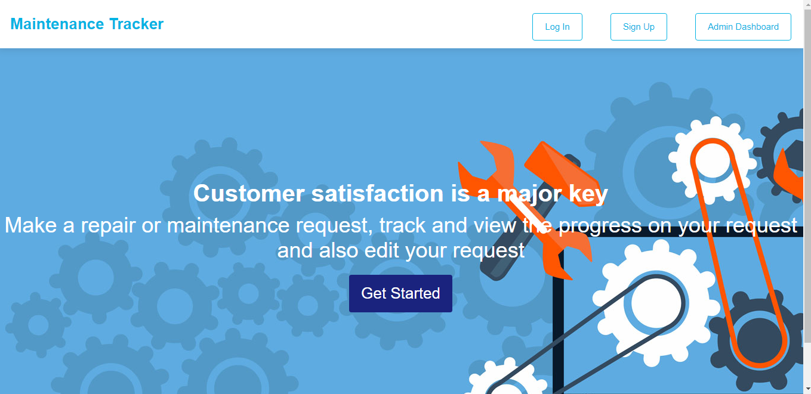

# Maintenance-Tracker
Maintenance Tracker App is an application that provides users with the ability to reach out to operations or repairs department regarding repair or maintenance requests and monitor the status of their request.
## Features currently implemented

Currently, only UI templates have been implemented
- `Signup` Interface for user to create an account with Maintenance Tracker
- `Login` Interface for user to login into their accounts
- `User Home` Interface for user to view, their requests and create new ones as well
- `Admin Dashboard` Interface for admin to view all app requests and perform operations on them

## Use code locally on your machine
To run this code on your local machine, first clone the repository
```
$ git clone https://github.com/lytes20/Maintenance-Tracker.git
```
Locate the `index.html` file in the `UI` directory and open it in your browser

